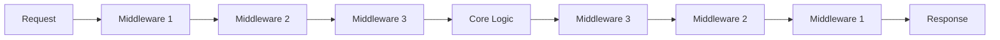

Middleware provides a powerful way to intercept and modify agent behavior at three levels: **agent invocations**, **chat client requests**, and **function/tool executions**. Middleware enables cross-cutting concerns like logging, authentication, caching, rate limiting, and error handling without modifying core agent logic.

## Middleware Types

The framework provides three middleware types:

<CardGroup cols={3}>
  <Card title="Agent Middleware" icon="robot">
    Intercepts `agent.run()` calls. Use for request validation, session management, and result transformation.
  </Card>
  <Card title="Chat Middleware" icon="message">
    Intercepts chat client requests. Use for prompt engineering, message filtering, and response caching.
  </Card>
  <Card title="Function Middleware" icon="wrench">
    Intercepts tool/function invocations. Use for argument validation, result caching, and execution logging.
  </Card>
</CardGroup>

## How Middleware Works

Middleware forms a pipeline where each middleware can:
1. **Inspect** the incoming request (context object)
2. **Modify** the request before it reaches the next layer
3. **Call** the next middleware via `call_next()`
4. **Inspect/modify** the response after execution
5. **Short-circuit** execution by not calling `call_next()`



## Agent Middleware

<Tabs>
  <Tab title="Python">
    ### Class-Based Middleware

    ```python
    from agent_framework import AgentMiddleware, AgentContext
    from collections.abc import Awaitable, Callable
    import time

    class LoggingMiddleware(AgentMiddleware):
        """Log agent invocations and timing."""

        async def process(
            self,
            context: AgentContext,
            call_next: Callable[[], Awaitable[None]],
        ) -> None:
            print(f"Agent: {context.agent.name}")
            print(f"Messages: {len(context.messages)}")
            print(f"Streaming: {context.stream}")

            start = time.time()
            await call_next()  # Execute agent
            duration = time.time() - start

            print(f"Completed in {duration:.2f}s")
            if context.result:
                print(f"Result: {context.result.text[:100]}...")

    # Use with agent
    agent = client.as_agent(
        name="Assistant",
        middleware=[LoggingMiddleware()],
    )
    ```

    ### Function-Based Middleware

    ```python
    from agent_framework import agent_middleware, AgentContext

    @agent_middleware
    async def retry_middleware(context: AgentContext, call_next):
        """Retry failed agent invocations."""
        max_retries = 3
        for attempt in range(max_retries):
            await call_next()
            if context.result and not getattr(context.result, 'error', None):
                break
            if attempt < max_retries - 1:
                print(f"Retry {attempt + 1}/{max_retries}")

    agent = client.as_agent(
        name="Assistant",
        middleware=[retry_middleware],
    )
    ```

    ### Context Properties

    `AgentContext` provides:
    - `agent` - The agent instance
    - `messages` - Input messages
    - `session` - Agent session (if provided)
    - `options` - Runtime options dict
    - `stream` - Whether streaming is enabled
    - `result` - Agent response (available after `call_next()`)
    - `metadata` - Shared metadata dict for cross-middleware communication
    - `kwargs` - Additional keyword arguments
  </Tab>
  <Tab title=".NET">
    In .NET, middleware is implemented through the builder pattern:

    ```csharp
    using Microsoft.Agents.AI;
    using Microsoft.Extensions.AI;

    // Agent-level middleware via builder
    var agent = client.GetChatClient(deploymentName)
        .AsAIAgent(
            name: "Assistant",
            instructions: "You are helpful.")
        .AsBuilder()
        .UseOpenTelemetry(sourceName: "MyAgent")
        .Build();
    ```

    Custom middleware can be added through extension methods on the builder.
  </Tab>
</Tabs>

## Function Middleware

<Tabs>
  <Tab title="Python">
    ### Class-Based Function Middleware

    ```python
    from agent_framework import FunctionMiddleware, FunctionInvocationContext
    import time

    class CachingMiddleware(FunctionMiddleware):
        """Cache function results."""

        def __init__(self):
            self.cache = {}

        async def process(
            self,
            context: FunctionInvocationContext,
            call_next,
        ) -> None:
            # Create cache key from function name and arguments
            cache_key = f"{context.function.name}:{context.arguments}"

            # Check cache
            if cache_key in self.cache:
                print(f"Cache hit for {context.function.name}")
                context.result = self.cache[cache_key]
                return  # Don't call next - use cached result

            # Execute function
            await call_next()

            # Cache result
            if context.result:
                self.cache[cache_key] = context.result
                print(f"Cached result for {context.function.name}")

    agent = client.as_agent(
        name="Assistant",
        tools=my_tool,
        middleware=[CachingMiddleware()],
    )
    ```

    ### Function-Based Function Middleware

    ```python
    from agent_framework import function_middleware, FunctionInvocationContext

    @function_middleware
    async def timing_middleware(context: FunctionInvocationContext, call_next):
        """Log function execution time."""
        print(f"Calling: {context.function.name}")
        start = time.time()

        await call_next()

        duration = time.time() - start
        print(f"{context.function.name} completed in {duration:.2f}s")

    agent = client.as_agent(
        name="Assistant",
        tools=my_tool,
        middleware=[timing_middleware],
    )
    ```

    ### Context Properties

    `FunctionInvocationContext` provides:
    - `function` - The FunctionTool being invoked
    - `arguments` - Validated function arguments
    - `result` - Function result (available after `call_next()`)
    - `metadata` - Shared metadata dict
    - `kwargs` - Runtime keyword arguments
  </Tab>
  <Tab title=".NET">
    Function middleware in .NET is configured through the `FunctionInvokingChatClient`:

    ```csharp
    var chatClient = client.GetChatClient(deploymentName)
        .AsBuilder()
        .UseFunctionInvocation()
        // Additional middleware can be configured here
        .Build();

    var agent = chatClient.AsAIAgent(
        name: "Assistant",
        tools: [AIFunctionFactory.Create(MyTool)]);
    ```
  </Tab>
</Tabs>

## Chat Middleware

<Tabs>
  <Tab title="Python">
    ### Class-Based Chat Middleware

    ```python
    from agent_framework import ChatMiddleware, ChatContext
    from agent_framework import Message

    class SystemPromptMiddleware(ChatMiddleware):
        """Inject system prompt into all requests."""

        def __init__(self, system_prompt: str):
            self.system_prompt = system_prompt

        async def process(self, context: ChatContext, call_next) -> None:
            # Insert system prompt at beginning
            system_msg = Message(role="system", text=self.system_prompt)
            context.messages.insert(0, system_msg)

            await call_next()

    # Use with agent
    agent = Agent(
        client=client,
        name="Assistant",
        middleware=[SystemPromptMiddleware("You are a helpful assistant.")],
    )
    ```

    ### Function-Based Chat Middleware

    ```python
    from agent_framework import chat_middleware, ChatContext

    @chat_middleware
    async def token_counter(context: ChatContext, call_next):
        """Count input/output tokens."""
        input_tokens = sum(len(m.text or "") for m in context.messages)
        context.metadata["input_tokens"] = input_tokens

        await call_next()

        if context.result:
            output_tokens = sum(len(m.text or "") for m in context.result.messages)
            context.metadata["output_tokens"] = output_tokens
            print(f"Tokens: {input_tokens} in, {output_tokens} out")

    agent = client.as_agent(
        name="Assistant",
        middleware=[token_counter],
    )
    ```

    ### Context Properties

    `ChatContext` provides:
    - `client` - The chat client instance
    - `messages` - Messages being sent
    - `options` - Chat options dict
    - `stream` - Whether streaming is enabled
    - `result` - Chat response (available after `call_next()`)
    - `metadata` - Shared metadata dict
    - `kwargs` - Runtime keyword arguments
  </Tab>
  <Tab title=".NET">
    Chat middleware is configured through the chat client builder:

    ```csharp
    var chatClient = client.GetChatClient(deploymentName)
        .AsBuilder()
        .Use(async (messages, options, next) =>
        {
            // Pre-processing
            Console.WriteLine($"Sending {messages.Count} messages");

            var result = await next(messages, options);

            // Post-processing
            Console.WriteLine($"Received response");
            return result;
        })
        .Build();
    ```
  </Tab>
</Tabs>

## Middleware Composition

<Tabs>
  <Tab title="Python">
    Middleware can be registered at agent creation or per-run:

    ```python
    # Agent-level middleware (applies to all runs)
    agent = client.as_agent(
        name="Assistant",
        middleware=[
            LoggingMiddleware(),
            SecurityMiddleware(),
            CachingMiddleware(),
        ],
    )

    # Run-level middleware (applies to specific run)
    result = await agent.run(
        "Hello",
        middleware=[RateLimitMiddleware()],  # Merged with agent middleware
    )

    # Middleware executes in order:
    # 1. LoggingMiddleware
    # 2. SecurityMiddleware  
    # 3. CachingMiddleware
    # 4. RateLimitMiddleware (run-level)
    # 5. Core agent logic
    # Then reverse order for post-processing
    ```
  </Tab>
  <Tab title=".NET">
    Middleware is composed through the builder pattern:

    ```csharp
    var agent = client.GetChatClient(deploymentName)
        .AsBuilder()
        .Use(middleware1)
        .Use(middleware2)
        .UseOpenTelemetry()
        .Build()
        .AsAIAgent(name: "Assistant");
    ```
  </Tab>
</Tabs>

## Advanced Patterns

### Short-Circuiting Execution

<Tabs>
  <Tab title="Python">
    ```python
    from agent_framework import AgentMiddleware, MiddlewareTermination

    class SecurityMiddleware(AgentMiddleware):
        async def process(self, context: AgentContext, call_next) -> None:
            # Check for sensitive data
            last_message = context.messages[-1] if context.messages else None
            if last_message and "password" in last_message.text.lower():
                # Override result and don't call next
                context.result = AgentResponse(
                    messages=[Message("assistant", "Cannot process sensitive information.")]
                )
                return  # Skip execution

            await call_next()  # Continue if check passes
    ```
  </Tab>
  <Tab title=".NET">
    ```csharp
    // Short-circuit by returning early
    .Use(async (messages, options, next) =>
    {
        if (ContainsSensitiveData(messages))
        {
            return new ChatResponse(
                new[] { new ChatMessage("Cannot process sensitive information.") });
        }
        return await next(messages, options);
    })
    ```
  </Tab>
</Tabs>

### Shared State Between Middleware

<Tabs>
  <Tab title="Python">
    ```python
    @agent_middleware
    async def set_metadata(context: AgentContext, call_next):
        context.metadata["request_id"] = str(uuid.uuid4())
        context.metadata["start_time"] = time.time()
        await call_next()

    @agent_middleware
    async def log_metadata(context: AgentContext, call_next):
        await call_next()
        request_id = context.metadata.get("request_id")
        duration = time.time() - context.metadata.get("start_time", 0)
        print(f"Request {request_id} took {duration:.2f}s")

    agent = client.as_agent(
        name="Assistant",
        middleware=[set_metadata, log_metadata],
    )
    ```
  </Tab>
  <Tab title=".NET">
    Share state through closure variables:

    ```csharp
    var requestId = Guid.NewGuid().ToString();
    var startTime = DateTime.UtcNow;

    .Use(async (messages, options, next) =>
    {
        var result = await next(messages, options);
        var duration = DateTime.UtcNow - startTime;
        Console.WriteLine($"Request {requestId} took {duration.TotalSeconds}s");
        return result;
    })
    ```
  </Tab>
</Tabs>

### Conditional Middleware

<Tabs>
  <Tab title="Python">
    ```python
    class ConditionalMiddleware(AgentMiddleware):
        def __init__(self, condition: Callable[[AgentContext], bool]):
            self.condition = condition

        async def process(self, context: AgentContext, call_next) -> None:
            if self.condition(context):
                print("Condition met, applying special logic")
                # Apply special logic
            await call_next()

    # Use only for specific agents
    agent = client.as_agent(
        name="SpecialAgent",
        middleware=[
            ConditionalMiddleware(lambda ctx: ctx.agent.name == "SpecialAgent")
        ],
    )
    ```
  </Tab>
  <Tab title=".NET">
    ```csharp
    .Use(async (messages, options, next) =>
    {
        if (ShouldApplyMiddleware(messages))
        {
            // Apply special logic
        }
        return await next(messages, options);
    })
    ```
  </Tab>
</Tabs>

## Example: Complete Middleware Stack

<Tabs>
  <Tab title="Python">
    ```python
    from agent_framework import (
        AgentMiddleware,
        FunctionMiddleware,
        AgentContext,
        FunctionInvocationContext,
        agent_middleware,
        function_middleware,
    )
    import time
    import logging

    # Security middleware
    class SecurityMiddleware(AgentMiddleware):
        async def process(self, context: AgentContext, call_next) -> None:
            # Check authentication
            if not context.kwargs.get("user_id"):
                raise ValueError("Authentication required")
            await call_next()

    # Logging middleware
    @agent_middleware
    async def request_logger(context: AgentContext, call_next):
        logging.info(f"Request: {context.agent.name}")
        await call_next()
        logging.info(f"Response: {context.result.text[:100] if context.result else 'None'}")

    # Caching middleware
    class CachingFunctionMiddleware(FunctionMiddleware):
        def __init__(self):
            self.cache = {}

        async def process(self, context: FunctionInvocationContext, call_next) -> None:
            key = f"{context.function.name}:{context.arguments}"
            if key in self.cache:
                context.result = self.cache[key]
                return
            await call_next()
            if context.result:
                self.cache[key] = context.result

    # Timing middleware
    @function_middleware
    async def function_timer(context: FunctionInvocationContext, call_next):
        start = time.time()
        await call_next()
        duration = time.time() - start
        logging.info(f"{context.function.name}: {duration:.2f}s")

    # Create agent with full middleware stack
    agent = client.as_agent(
        name="ProductionAgent",
        instructions="You are a production-grade assistant.",
        tools=[search_tool, calculate_tool],
        middleware=[
            SecurityMiddleware(),
            request_logger,
            CachingFunctionMiddleware(),
            function_timer,
        ],
    )

    # Use agent
    result = await agent.run(
        "Search for Python tutorials",
        user_id="user-123",  # Required by SecurityMiddleware
    )
    ```
  </Tab>
  <Tab title=".NET">
    ```csharp
    var agent = client.GetChatClient(deploymentName)
        .AsBuilder()
        .Use(async (messages, options, next) =>
        {
            // Security check
            if (!options.AdditionalProperties?.ContainsKey("user_id") ?? true)
                throw new InvalidOperationException("Authentication required");
            return await next(messages, options);
        })
        .Use(async (messages, options, next) =>
        {
            // Logging
            Console.WriteLine($"Request: {messages.Count} messages");
            var result = await next(messages, options);
            Console.WriteLine($"Response: {result.Messages.Count} messages");
            return result;
        })
        .UseFunctionInvocation()
        .UseOpenTelemetry(sourceName: "ProductionAgent")
        .Build()
        .AsAIAgent(
            name: "ProductionAgent",
            instructions: "You are a production-grade assistant.",
            tools: [AIFunctionFactory.Create(SearchTool)]);
    ```
  </Tab>
</Tabs>

## Best Practices

<Note>
**Middleware Design Tips**

1. **Single Responsibility**: Each middleware should do one thing well
2. **Order Matters**: Security/auth middleware should run first
3. **Performance**: Keep middleware lightweight; avoid heavy computation
4. **Error Handling**: Handle exceptions gracefully, don't break the pipeline
5. **Metadata**: Use `context.metadata` for cross-middleware communication
6. **Idempotency**: Middleware should be safe to run multiple times
</Note>

<Warning>
**Production Considerations**

- **Security First**: Always validate authentication/authorization early in the pipeline
- **Monitoring**: Add telemetry middleware for production observability
- **Rate Limiting**: Implement rate limiting to prevent abuse
- **Timeout Handling**: Set timeouts to prevent hanging requests
- **Error Logging**: Log all errors for debugging
- **Testing**: Test middleware in isolation before integration
</Warning>

## Next Steps

<CardGroup cols={2}>
  <Card title="Observability" icon="chart-line" href="/concepts/observability">
    Monitor middleware execution with OpenTelemetry
  </Card>
  <Card title="Sessions" icon="comments" href="/concepts/sessions">
    Manage state across middleware invocations
  </Card>
  <Card title="Tools" icon="wrench" href="/concepts/tools">
    Learn about function middleware for tools
  </Card>
  <Card title="Agents" icon="robot" href="/concepts/agents">
    Understand agent middleware integration
  </Card>
</CardGroup>
