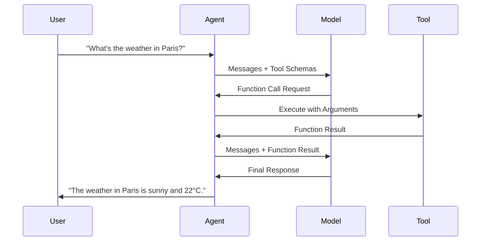

Tools allow agents to extend their capabilities beyond text generation by calling functions, accessing databases, making API requests, or performing computations. The framework automatically handles function calling, parameter validation, and result formatting.

## What are Tools?

Tools (also called "functions" or "function tools") are Python/C# functions that agents can invoke to:
- Retrieve real-time data (weather, stock prices, news)
- Perform calculations or data processing
- Execute actions (send emails, create tickets)
- Access databases or search engines
- Interact with external APIs

The framework uses JSON Schema to describe function parameters to the model, validates arguments, executes functions, and returns results.

## Defining a Tool

<Tabs>
  <Tab title="Python">
    Use the `@tool` decorator to convert any function into a tool:

    ```python
    from agent_framework import tool
    from typing import Annotated
    from pydantic import Field

    @tool(approval_mode="never_require")  # Use "always_require" in production!
    def get_weather(
        location: Annotated[str, Field(description="The city name")],
        unit: Annotated[str, Field(description="Temperature unit")] = "celsius",
    ) -> str:
        """Get the current weather for a location."""
        # Simulate API call
        return f"The weather in {location} is sunny and 22°{unit[0].upper()}."
    ```

    **Key Points:**
    - The docstring becomes the tool description shown to the model
    - Use `Annotated[type, Field(description="...")]` for parameter descriptions
    - Set `approval_mode="always_require"` in production to require user confirmation
    - Return type should be JSON-serializable or a string
  </Tab>
  <Tab title=".NET">
    Use attributes to define tool functions:

    ```csharp
    using System.ComponentModel;
    using Microsoft.Extensions.AI;

    [Description("Get the current weather for a location.")]
    static string GetWeather(
        [Description("The city name")] string location,
        [Description("Temperature unit (celsius/fahrenheit)")] string unit = "celsius")
    {
        // Simulate API call
        return $"The weather in {location} is sunny and 22°{unit[0].ToString().ToUpper()}.";
    }

    // Register with agent
    var agent = client.GetChatClient(deploymentName).AsAIAgent(
        name: "WeatherAgent",
        instructions: "You provide weather information.",
        tools: [AIFunctionFactory.Create(GetWeather)]);
    ```

    **Key Points:**
    - The `[Description]` attribute documents the function and parameters
    - Use `AIFunctionFactory.Create()` to register functions as tools
    - Return type should be JSON-serializable or a string
  </Tab>
</Tabs>

## Using Tools with Agents

<Tabs>
  <Tab title="Python">
    Pass tools to the agent when creating it:

    ```python
    from agent_framework.azure import AzureOpenAIResponsesClient

    agent = client.as_agent(
        name="WeatherAgent",
        instructions="You are a weather assistant. Use the get_weather tool to answer questions.",
        tools=get_weather,  # Single tool
    )

    # Or multiple tools
    agent = client.as_agent(
        name="Assistant",
        instructions="You are a helpful assistant.",
        tools=[get_weather, calculate_tip, search_web],  # Multiple tools
    )

    # Use the agent
    result = await agent.run("What's the weather in Seattle?")
    print(result.text)
    # Output: "The weather in Seattle is sunny and 22°C."
    ```
  </Tab>
  <Tab title=".NET">
    Register tools with the agent:

    ```csharp
    var agent = client.GetChatClient(deploymentName).AsAIAgent(
        name: "WeatherAgent",
        instructions: "You are a weather assistant.",
        tools: [
            AIFunctionFactory.Create(GetWeather),
            AIFunctionFactory.Create(CalculateTip)
        ]);

    var result = await agent.RunAsync("What's the weather in Seattle?");
    Console.WriteLine(result.Messages.LastOrDefault()?.Text);
    ```
  </Tab>
</Tabs>

## Tool Schemas

<Tabs>
  <Tab title="Python">
    The framework automatically generates JSON Schema from function signatures:

    ```python
    @tool
    def search_database(
        query: Annotated[str, Field(description="Search query")],
        filters: Annotated[dict[str, str], Field(description="Filters")] = None,
        limit: Annotated[int, Field(description="Max results", ge=1, le=100)] = 10,
    ) -> list[dict]:
        """Search the product database."""
        ...

    # Generated schema (accessible via tool.parameters())
    {
        "type": "object",
        "properties": {
            "query": {
                "type": "string",
                "description": "Search query"
            },
            "filters": {
                "type": "object",
                "description": "Filters"
            },
            "limit": {
                "type": "integer",
                "description": "Max results",
                "minimum": 1,
                "maximum": 100,
                "default": 10
            }
        },
        "required": ["query"]
    }
    ```

    You can also provide an explicit schema:

    ```python
    from pydantic import BaseModel

    class WeatherInput(BaseModel):
        location: str = Field(description="City name")
        unit: str = Field(default="celsius", description="Temperature unit")

    @tool(schema=WeatherInput)
    def get_weather(location: str, unit: str = "celsius") -> str:
        """Get the weather."""
        ...
    ```
  </Tab>
  <Tab title=".NET">
    The framework automatically infers schemas from method signatures:

    ```csharp
    [Description("Search the product database.")]
    static async Task<List<Product>> SearchDatabase(
        [Description("Search query")] string query,
        [Description("Filters")] Dictionary<string, string>? filters = null,
        [Description("Max results (1-100)")] int limit = 10)
    {
        // Implementation
        ...
    }

    var tool = AIFunctionFactory.Create(SearchDatabase);
    ```
  </Tab>
</Tabs>

## Async Tools

<Tabs>
  <Tab title="Python">
    Both sync and async functions are supported:

    ```python
    import httpx

    @tool(approval_mode="never_require")
    async def fetch_news(topic: Annotated[str, Field(description="News topic")]) -> str:
        """Fetch latest news about a topic."""
        async with httpx.AsyncClient() as client:
            response = await client.get(f"https://api.news.com/search?q={topic}")
            return response.json()["articles"][0]["title"]

    # Framework automatically awaits async functions
    agent = client.as_agent(
        name="NewsAgent",
        tools=fetch_news,
    )
    ```
  </Tab>
  <Tab title=".NET">
    Async functions are fully supported:

    ```csharp
    [Description("Fetch latest news about a topic.")]
    static async Task<string> FetchNews([Description("News topic")] string topic)
    {
        using var client = new HttpClient();
        var response = await client.GetStringAsync($"https://api.news.com/search?q={topic}");
        return response;
    }

    var agent = client.GetChatClient(deploymentName).AsAIAgent(
        name: "NewsAgent",
        tools: [AIFunctionFactory.Create(FetchNews)]);
    ```
  </Tab>
</Tabs>

## Tool Approval

<Tabs>
  <Tab title="Python">
    Require user approval before executing sensitive tools:

    ```python
    @tool(approval_mode="always_require")
    def send_email(
        to: Annotated[str, Field(description="Recipient email")],
        subject: Annotated[str, Field(description="Email subject")],
        body: Annotated[str, Field(description="Email body")],
    ) -> str:
        """Send an email."""
        # Send email
        return f"Email sent to {to}"

    agent = client.as_agent(
        name="EmailAgent",
        tools=send_email,
    )

    # When the model requests to call this tool, you'll get an approval request
    async for update in agent.run("Send an email to alice@example.com", stream=True):
        if update.approval_required:
            print(f"Tool call requires approval: {update.function_calls}")
            # Display to user and get approval
            approved = get_user_approval()
            if approved:
                # Continue with approved=True
                ...
    ```
  </Tab>
  <Tab title=".NET">
    Tool approval is managed through the function invocation flow:

    ```csharp
    // Mark tool as requiring approval
    var sendEmailTool = AIFunctionFactory.Create(
        SendEmail,
        name: "SendEmail",
        description: "Send an email (requires approval)");

    // Configure approval callback
    var options = new AgentRunOptions
    {
        // Custom approval logic
    };
    ```
  </Tab>
</Tabs>

## Advanced Tool Features

### Tool Invocation Limits

<Tabs>
  <Tab title="Python">
    Control how many times a tool can be called:

    ```python
    @tool(
        approval_mode="never_require",
        max_invocations=3,  # Limit to 3 calls per tool instance lifetime
        max_invocation_exceptions=2,  # Stop after 2 errors
    )
    def expensive_api_call(query: str) -> str:
        """Call an expensive external API."""
        ...

    # Use function invocation config for per-request limits
    from agent_framework.openai import OpenAIChatClient

    client = OpenAIChatClient()
    client.function_invocation_configuration["max_iterations"] = 5  # LLM roundtrips
    client.function_invocation_configuration["max_function_calls"] = 20  # Total calls
    ```
  </Tab>
  <Tab title=".NET">
    Configure invocation limits through run options:

    ```csharp
    var options = new AgentRunOptions
    {
        // Limits are typically configured at the chat client level
    };
    ```
  </Tab>
</Tabs>

### Custom Result Parsing

<Tabs>
  <Tab title="Python">
    Override how tool results are serialized:

    ```python
    def custom_parser(result: Any) -> str:
        """Custom result serializer."""
        if isinstance(result, MyCustomClass):
            return result.to_json()
        return str(result)

    @tool(result_parser=custom_parser)
    def get_data() -> MyCustomClass:
        """Get custom data."""
        return MyCustomClass(...)
    ```
  </Tab>
  <Tab title=".NET">
    Return types are automatically serialized to JSON:

    ```csharp
    [Description("Get custom data.")]
    static MyCustomClass GetData()
    {
        return new MyCustomClass { ... };
    }
    // Automatically serialized to JSON
    ```
  </Tab>
</Tabs>

### Declaration-Only Tools

<Tabs>
  <Tab title="Python">
    Create tools that agents can reason about without executing:

    ```python
    from agent_framework import FunctionTool

    # Tool declaration without implementation
    time_tool = FunctionTool(
        name="get_current_time",
        description="Get the current time in ISO 8601 format.",
        func=None,  # No implementation
    )

    # Agent can see and request the tool, but it won't execute
    # Useful for testing agent reasoning or client-side implementations
    ```
  </Tab>
  <Tab title=".NET">
    Declaration-only tools are less common in .NET but can be achieved by not providing an implementation:

    ```csharp
    // Typically, tools require implementations in .NET
    ```
  </Tab>
</Tabs>

## Tool Execution Flow



## Best Practices

<Note>
**Tool Design Tips**

1. **Clear Descriptions**: Write detailed docstrings and parameter descriptions
2. **Input Validation**: Use Pydantic Field constraints for validation
3. **Error Handling**: Return helpful error messages, don't raise exceptions
4. **Idempotency**: Tools should be safe to retry
5. **Performance**: Keep tools fast; use async for I/O operations
6. **Security**: Always use `approval_mode="always_require"` for sensitive operations
</Note>

<Warning>
**Production Considerations**

- **Rate Limiting**: Protect external APIs from abuse
- **Timeout Handling**: Set timeouts for external calls
- **Secret Management**: Never hardcode API keys in tool code
- **Logging**: Log tool executions for debugging and auditing
- **Cost Control**: Monitor and limit expensive API calls
- **Testing**: Test tools independently before agent integration
</Warning>

## Example: Complete Weather Agent

<Tabs>
  <Tab title="Python">
    ```python
    import httpx
    from agent_framework import tool
    from agent_framework.azure import AzureOpenAIResponsesClient
    from typing import Annotated
    from pydantic import Field
    import os

    @tool(approval_mode="never_require")
    async def get_weather(
        location: Annotated[str, Field(description="City name")],
        unit: Annotated[str, Field(description="celsius or fahrenheit")] = "celsius",
    ) -> str:
        """Get current weather for a location."""
        api_key = os.environ["WEATHER_API_KEY"]
        async with httpx.AsyncClient() as client:
            response = await client.get(
                f"https://api.weather.com/current",
                params={"location": location, "unit": unit, "key": api_key},
            )
            data = response.json()
            return f"The weather in {location} is {data['condition']} with a temperature of {data['temp']}°{unit[0].upper()}."

    @tool(approval_mode="never_require")
    async def get_forecast(
        location: Annotated[str, Field(description="City name")],
        days: Annotated[int, Field(description="Number of days", ge=1, le=7)] = 3,
    ) -> str:
        """Get weather forecast for a location."""
        # Implementation
        ...

    async def main():
        client = AzureOpenAIResponsesClient(
            project_endpoint=os.environ["AZURE_AI_PROJECT_ENDPOINT"],
            deployment_name=os.environ["AZURE_OPENAI_RESPONSES_DEPLOYMENT_NAME"],
        )

        agent = client.as_agent(
            name="WeatherAgent",
            instructions="You are a weather assistant. Use the tools to provide accurate weather information.",
            tools=[get_weather, get_forecast],
        )

        session = agent.create_session()

        # Multi-turn conversation
        questions = [
            "What's the weather in Seattle?",
            "How about the 5-day forecast?",
            "Compare it to San Francisco",
        ]

        for question in questions:
            print(f"\nUser: {question}")
            result = await agent.run(question, session=session)
            print(f"Agent: {result.text}")
    ```
  </Tab>
  <Tab title=".NET">
    ```csharp
    using System.ComponentModel;
    using Microsoft.Agents.AI;
    using Microsoft.Extensions.AI;

    [Description("Get current weather for a location.")]
    static async Task<string> GetWeather(
        [Description("City name")] string location,
        [Description("celsius or fahrenheit")] string unit = "celsius")
    {
        var apiKey = Environment.GetEnvironmentVariable("WEATHER_API_KEY");
        using var client = new HttpClient();
        var response = await client.GetStringAsync(
            $"https://api.weather.com/current?location={location}&unit={unit}&key={apiKey}");
        return response;
    }

    [Description("Get weather forecast for a location.")]
    static async Task<string> GetForecast(
        [Description("City name")] string location,
        [Description("Number of days (1-7)")] int days = 3)
    {
        // Implementation
        return "";
    }

    var agent = client.GetChatClient(deploymentName).AsAIAgent(
        name: "WeatherAgent",
        instructions: "You are a weather assistant.",
        tools: [
            AIFunctionFactory.Create(GetWeather),
            AIFunctionFactory.Create(GetForecast)
        ]);

    var session = await agent.CreateSessionAsync();

    var questions = new[]
    {
        "What's the weather in Seattle?",
        "How about the 5-day forecast?",
        "Compare it to San Francisco"
    };

    foreach (var question in questions)
    {
        Console.WriteLine($"\nUser: {question}");
        var result = await agent.RunAsync(question, session);
        Console.WriteLine($"Agent: {result.Messages.LastOrDefault()?.Text}");
    }
    ```
  </Tab>
</Tabs>

## Next Steps

<CardGroup cols={2}>
  <Card title="Middleware" icon="layer-group" href="/concepts/middleware">
    Intercept and modify tool invocations with middleware
  </Card>
  <Card title="Sessions" icon="comments" href="/concepts/sessions">
    Manage conversation state across tool calls
  </Card>
  <Card title="Observability" icon="chart-line" href="/concepts/observability">
    Monitor tool performance and usage
  </Card>
  <Card title="Agents" icon="robot" href="/concepts/agents">
    Learn more about agent capabilities
  </Card>
</CardGroup>
